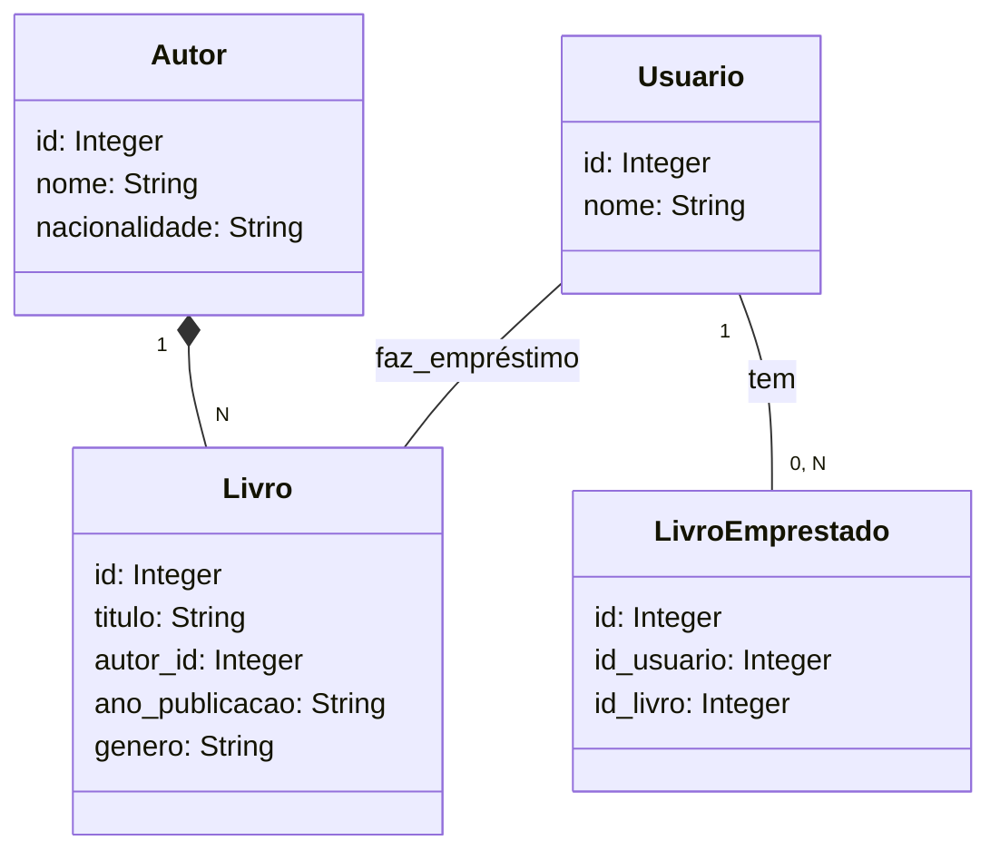

# Santander Dev Week 2023
___
## Tecnologias utilizadas
- Java 17
- Spring Boot 3
- Spring Data JPA
- Railway
___

Projeto desenvolvido para o desafio "Publicando Sua API REST na Nuvem
Usando Spring Boot 3, Java 17 e Railway" do Santander Bootcamp 2023 -
Backend Java da DIO. Desenvolvi minha api considerando o contexto de 
uma biblioteca, e além dos enpoints para consultar dados do banco de dados,
também fiz endpoints para pegar um livro emprestado, que cria um novo
registro na tabela de livros emprestados, e devolver um livro, que apaga
uma linha da tabela de livros emprestados usando o id.

## Diagrama de Classes

## Deployment da API no Railway

https://www.api-biblioteca.up.railway.app

### Endpoints
- /usuarios/find/all (GET)
- /usuarios/find/all/livros_emprestados/{id} (GET)
- /usuarios/find/one/byid/{id} (GET)
- /usuarios/pegar_emprestado/{id}/{titulo} (POST)
- /livros/find/all (GET)
- /livros/find/all/byautor/{autor} (GET)
- /livros/find/one/byid/{id} (GET)
- /livros/find/one/bytitulo/{titulo} (GET)
- /livros/save (POST)
- /livros/update/{id} (PUT)
- /livros/delete/{id} (DELETE)
- /autores/find/all (GET)
- /autores/find/all/bynacionalidade/{nacionalidade} (GET)
- /autores/find/one/byid/{id} (GET)
- /autores/find/one/bynome/{nome} (GET)
- /autores/save (POST)
- /autores/update/{id} (PUT)
- /livrosemprestados/find/all (GET)
- /livrosemprestados/devolucao/{id_usuario}/{id_livro} (DELETE)
